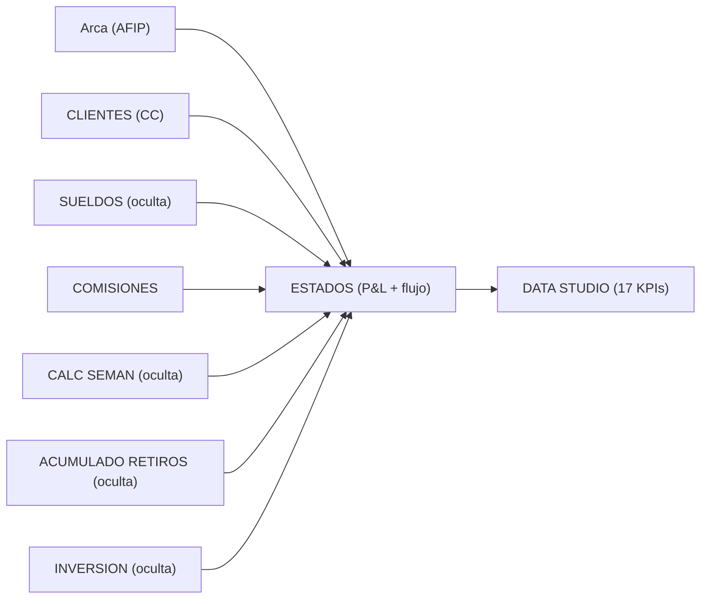
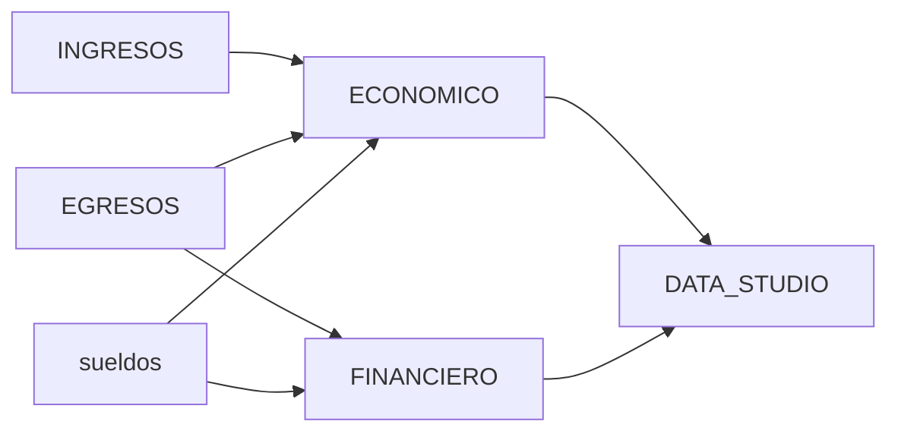

# Documento Maestro — Resúmenes Mensuales DON AMERICO 2026

**Archivos analizados:** 4 (`ENERO`, `FEBRERO`, `MARZO`, `ABRIL` 2026)
**Tipo:** `.xlsx` — sin macros VBA
**Fecha de análisis:** 26/05/2026

---

## 1. Resumen Ejecutivo

Los 4 archivos representan el **cierre económico-financiero mensual** del comercio Don Américo (supermercado/almacén multi-rubro en San Juan). Cada archivo es autocontenido: vuelca la operación de un mes y produce 17 indicadores estandarizados en una hoja `DATA STUDIO` pensada para alimentar un BI externo (presumiblemente Google Data Studio / Looker Studio).

**Hallazgo estructural clave:** existen **dos formatos distintos** entre los archivos. ENERO y FEBRERO siguen una convención antigua (1 hoja `ESTADOS` que combina P&L + flujo, con 6 hojas auxiliares ocultas). MARZO y ABRIL siguen una convención nueva donde el contenido de `ESTADOS` se separa en dos hojas (`ECONOMICO` + `FINANCIERO`) y los datos crudos quedan en `INGRESOS` y `EGRESOS` visibles. La hoja `DATA STUDIO` se mantiene idéntica en estructura entre ambos formatos — **es la única superficie estable y la que debe usarse como capa de mapeo para el dashboard.**

**Complejidad:** media. ~325 fórmulas por archivo, ninguna avanzada según el clasificador automático (las fórmulas "críticas" detectadas en MAR/ABR son referencias cruzadas entre `ECONOMICO`↔`FINANCIERO`, no anidamientos complejos). Sin macros. Sin named ranges. Sin protecciones.

**Recomendación general:** **NO** apoyar el dashboard sobre `ESTADOS`/`ECONOMICO` directamente — las celdas se mueven entre formatos. Apoyarlo sobre `DATA STUDIO`, que tiene rótulos estables en `A2:A17`, más una segunda capa que lea los rubros desde `ESTADOS!A11:B27` (ENE/FEB) o `ECONOMICO!A11:B28` (MAR/ABR).

### Métricas clave (por archivo)

| Métrica                | ENERO  | FEBRERO | MARZO  | ABRIL  |
|------------------------|--------|---------|--------|--------|
| Total de hojas         | 10     | 10      | 9      | 9      |
| Hojas visibles         | 4      | 4       | 9      | 9      |
| Hojas ocultas          | 6      | 6       | 0      | 0      |
| Total de fórmulas      | 342    | 335     | 320    | 325    |
| Fórmulas críticas\*    | 0      | 0       | 56     | 59     |
| Named ranges           | 0      | 0       | 0      | 0      |
| Macros VBA             | 0      | 0       | 0      | 0      |

\* "Críticas" aquí significa fórmula con referencias cruzadas a varias hojas (`ECONOMICO`↔`FINANCIERO`), no complejidad de cálculo.

---

## 2. Inventario de Hojas

### Formato ENERO / FEBRERO (legacy)

| # | Hoja                  | Estado  | Rol                                                              |
|---|-----------------------|---------|------------------------------------------------------------------|
| 1 | `Arca`                | oculta  | Tablero de comprobantes AFIP (facturación electrónica)           |
| 2 | `ESTADOS`             | visible | **Hoja maestra**: P&L + flujo de caja consolidado en una sola hoja |
| 3 | `Hoja 14`             | visible | Notas/observaciones del mes (no estructurado)                    |
| 4 | `DATA STUDIO`         | visible | **17 KPIs normalizados** — superficie de salida estable          |
| 5 | `ACUMULADO DE RETIROS`| oculta  | Tracking de retiros de socios                                    |
| 6 | `CLIENTES`            | oculta  | Cuenta corriente clientes                                        |
| 7 | `CALC SEMAN`          | oculta  | Cálculos semanales                                               |
| 8 | `COMISIONES`          | visible | Detalle de comisiones bancarias / posnet                         |
| 9 | `SUELDOS`             | oculta  | Detalle de empleados y haberes                                   |
| 10| `INVERSION`           | oculta  | Inversiones / dolarizaciones del mes                             |

### Formato MARZO / ABRIL (nuevo)

| # | Hoja                | Estado  | Rol                                                       |
|---|---------------------|---------|-----------------------------------------------------------|
| 1 | `ECONOMICO`         | visible | **P&L del mes** (devengado) — antes era cols A-D de ESTADOS |
| 2 | `FINANCIERO`        | visible | Flujo de caja del mes — antes era cols F-G de ESTADOS     |
| 3 | `EGRESOS`           | visible | Datos crudos de egresos (3457 filas)                      |
| 4 | `INGRESOS`          | visible | Datos crudos de ingresos (5788 filas)                     |
| 5 | `Tabla dinámica 1`  | visible | Pivot vacío (placeholder)                                 |
| 6 | `Tabla egresos`     | visible | Pivot vacío (placeholder)                                 |
| 7 | `Tabla ingresos`    | visible | Pivot vacío (placeholder)                                 |
| 8 | `sueldos`           | visible | Detalle de empleados y haberes (antes oculta)             |
| 9 | `DATA STUDIO`       | visible | **17 KPIs normalizados** — idéntica estructura            |

---

## 3. La capa estable: `DATA STUDIO`

Es la **única hoja idéntica en los 4 archivos**. Layout fijo `A2:B17`:

| Fila | Etiqueta (col A)                       | Valor (col B)         | Mapeo dashboard       |
|------|----------------------------------------|------------------------|------------------------|
| 2    | `VENTAS`                               | Ingresos totales       | `ventas` / KPI 1       |
| 3    | `COSTO DE VENTAS`                      | Reposición de stock    | `costo_ventas`         |
| 4    | `GASTOS`                               | Gastos generales       | `gastos_empresa`       |
| 5    | `IMPUESTOS`                            | Cargas fiscales        | `impuestos` ⚠️         |
| 6    | `SERVICIOS`                            | Luz, gas, alquiler...  | `servicios`            |
| 7    | `EMPLEADOS`                            | Sueldos + cargas       | `sueldos`              |
| 8    | `SOCIOS`                               | Retiros de socios ⚠️   | (no usar — duplicado)  |
| 9    | `GASTOS Y COMISIONES BANCARIAS`        | Comisiones bancarias   | `gastos_bancarios`     |
| 10   | `GASTOS Y COMISIONES MERCADO PAGO`     | Comisiones MP          | `gastos_mercado_pago`  |
| 11   | `GASTOS Y COMISIONES POSNET`           | Comisiones posnet      | `gastos_posnet`        |
| 12   | `EXTRAORDINARIOS`                      | Gastos no recurrentes  | `extraordinarios`      |
| 13   | `RESULTADO ECONOMICO`                  | = Ventas − Egresos     | `resultado_economico`  |
| 14   | `SALDO CLIENTES`                       | CC clientes            | `saldo_clientes` ⚠️    |
| 15   | `SALDO PROVEEDORES`                    | CC proveedores         | `saldo_proveedores` ⚠️ |
| 16   | `STOCK AL CIERRE`                      | Inventario             | `stock_cierre` ⚠️      |
| 17   | `COMPRAS`                              | Compra de mercadería   | `compras`              |

### Verificación cruzada de consistencia

Confirmé que **`RESULTADO_ECONOMICO` (B13) = `VENTAS` − Σ(8 rubros de egreso)** en los 4 archivos (diferencia < 0.05 ARS, atribuible a redondeo). La identidad contable cierra.

---

## 4. La capa de rubros: `ESTADOS` / `ECONOMICO`

`DATA STUDIO` NO contiene el desglose de **Ventas por Rubro**. Eso vive en:

- **ENE/FEB:** `ESTADOS!A11:B27` (rótulos en A, montos en B)
- **MAR/ABR:** `ECONOMICO!A11:B28` (idéntica estructura, una fila más)

### Rubros canónicos detectados (orden por monto, promedio 4 meses)

| Rubro          | Presente en              | % promedio sobre ventas |
|----------------|--------------------------|--------------------------|
| CARNES         | 4/4                      | ~29%                     |
| FIAMBRES       | 4/4                      | ~14%                     |
| COMESTIBLES    | 4/4                      | ~12%                     |
| VERDURAS       | 4/4                      | ~9%                      |
| BEBIDAS        | 4/4                      | ~9%                      |
| PANIFICACION   | 4/4                      | ~5%                      |
| POLLO          | 4/4                      | ~4%                      |
| LACTEOS        | 4/4                      | ~4%                      |
| LIMPIEZA       | 4/4                      | ~3%                      |
| KIOSCO         | 4/4                      | ~3%                      |
| CERDO          | 4/4                      | ~2%                      |
| ROTISERIA      | 4/4                      | ~2%                      |
| PERFUMERIA     | 4/4                      | ~1%                      |
| FRESCOS        | 4/4                      | ~1%                      |
| CONGELADOS     | 4/4                      | ~1%                      |
| VARIOS         | 4/4                      | <1%                      |
| **DESCARTABLES** | **2/4 (sólo MAR/ABR)** | <1%                      |

El orden interno (filas 12-27/28) **varía entre meses** — POLLO está en fila 19 en ENE/MAR pero en fila 18 en FEB. **NO leer por fila — leer por rótulo (columna A).**

---

## 5. Grafo de Dependencias

### Formato legacy (ENE/FEB)



### Formato nuevo (MAR/ABR)



En MAR/ABR, `DATA STUDIO` referencia **ambas** hojas (`ECONOMICO!Cxx` para casi todo, `FINANCIERO!Cxx` sólo para `SOCIOS`). Esto cambia cuál celda exacta hay que leer para "GASTOS Y COMISIONES MP" según el mes — otra razón para apoyarse en `DATA STUDIO` y no en `ECONOMICO` directamente.

---

## 6. Hallazgos Clave y Riesgos

### 🔴 Riesgo alto — Inconsistencias de datos

1. **`IMPUESTOS` = 0 en 3 de 4 meses**
   - ENE = 0, FEB = 1,854,481.35, MAR = 0, ABR = 0
   - O bien los impuestos se cargan trimestralmente y FEB tuvo un pago atípico, o hay un **dato faltante sistemático**. El dashboard mostrará 0 para 3 de cada 4 barras del rubro Impuestos. **Validar con Walter / contadora si esto es real o un gap de carga.**

2. **`SALDO CLIENTES`, `SALDO PROVEEDORES`, `STOCK AL CIERRE` con huecos**
   - SALDO CLIENTES: presente sólo en FEB (3,185,413.62)
   - SALDO PROVEEDORES: faltante en MAR
   - STOCK AL CIERRE: faltante en ABR
   - Estos son indicadores patrimoniales; su ausencia no afecta el dashboard P&L pero **rompe cualquier dashboard de balance**.

### 🟡 Riesgo medio — Duplicación funcional

3. **`SOCIOS` y `GASTOS Y COMISIONES MP` arrojan exactamente el mismo valor** en los 4 meses
   - ENE: ambos 762,787.29
   - FEB: ambos 2,121,427.62
   - MAR: ambos 2,268,969.06
   - ABR: ambos 2,688,190.74
   - Las fórmulas en `DATA STUDIO` apuntan a **celdas distintas** (B8=`FINANCIERO!C94` o `ESTADOS!H99`; B10=`ECONOMICO!C91` o `ESTADOS!C99`), pero el resultado coincide siempre. Hay dos hipótesis:
     - **(a)** Los retiros de socios se ejecutan vía cuenta MP y por eso convergen los montos (plausible operativamente).
     - **(b)** Una de las fórmulas está mal apuntada y replica accidentalmente el otro número.
   - Dado que el usuario **no incluyó SOCIOS** en el esquema del dashboard, el riesgo se neutraliza, pero **vale aclarárselo al cliente.**

### 🟡 Riesgo medio — Cambio de formato no documentado

4. **MAR/ABR tienen 3 pivots vacíos** (`Tabla dinámica 1`, `Tabla egresos`, `Tabla ingresos`) — restos de un intento de pivotar que quedó a medias. No afectan al dashboard pero confunden al revisar el archivo.

5. **`DESCARTABLES` apareció en MAR y ABR sin estar en ENE/FEB.** El dashboard debe tolerar rubros nuevos que aparezcan en cualquier mes. La columna "Otros" del esquema del usuario lo absorbe correctamente.

### 🟢 Observaciones

6. **Sin macros, sin protección, sin named ranges, sin validaciones de dato.** El archivo es completamente abierto — cualquiera con acceso puede romper la lógica al editar.

7. **`Hoja 14` en ENE/FEB contiene observaciones del mes en formato libre.** No estructurado. Útil como nota al pie, no para el dashboard.

8. **`Arca` en ENE/FEB es la importación de comprobantes AFIP.** Si el cliente ya está cargando comprobantes desde AFIP, podría ser fuente para la integración del Motor de Asientos CIAF más adelante.

---

## 7. Estructura de Mapeo Propuesta para Dashboard

### Principio: tabla única "ancha", una fila por mes

Para que el HTML pueda renderizar el dashboard con filtros Mes/Año/Todo, la opción más simple y robusta es **una sola tabla normalizada** (en Google Sheet o como CSV/JSON estático), con esta estructura:

| Columna                       | Tipo   | Fuente                                              |
|-------------------------------|--------|------------------------------------------------------|
| `mes_nombre`                  | string | constante                                            |
| `mes_num`                     | int    | constante (1-12)                                     |
| `año`                         | int    | constante                                            |
| `ventas`                      | number | `DATA STUDIO!B2`                                     |
| `costo_ventas`                | number | `DATA STUDIO!B3`                                     |
| `gastos_empresa`              | number | `DATA STUDIO!B4`                                     |
| `impuestos`                   | number | `DATA STUDIO!B5`                                     |
| `servicios`                   | number | `DATA STUDIO!B6`                                     |
| `sueldos`                     | number | `DATA STUDIO!B7`                                     |
| `gastos_bancarios`            | number | `DATA STUDIO!B9`                                     |
| `gastos_mercado_pago`         | number | `DATA STUDIO!B10`                                    |
| `gastos_posnet`               | number | `DATA STUDIO!B11`                                    |
| `extraordinarios`             | number | `DATA STUDIO!B12`                                    |
| `total_egresos`               | number | suma de las 8 anteriores (NO usar el de ECONOMICO)   |
| `resultado_economico`         | number | `DATA STUDIO!B13`                                    |
| `margen_neto`                 | number | `resultado_economico / ventas * 100`                 |
| `compras`                     | number | `DATA STUDIO!B17`                                    |
| `stock_cierre`                | number | `DATA STUDIO!B16`                                    |
| `saldo_proveedores`           | number | `DATA STUDIO!B15`                                    |
| `saldo_clientes`              | number | `DATA STUDIO!B14`                                    |
| `rubro_carnes`                | number | buscar `CARNES` en col A de `ESTADOS`/`ECONOMICO`    |
| `rubro_fiambres`              | number | buscar `FIAMBRES` en col A                           |
| `rubro_comestibles`           | number | buscar `COMESTIBLES` en col A                        |
| `rubro_bebidas`               | number | buscar `BEBIDAS` en col A                            |
| `rubro_verduras`              | number | buscar `VERDURAS` en col A                           |
| `rubro_panificacion`          | number | buscar `PANIFICACION` en col A                       |
| `rubro_pollo`                 | number | buscar `POLLO` en col A                              |
| `rubro_lacteos`               | number | buscar `LACTEOS` en col A                            |
| `rubro_limpieza`              | number | buscar `LIMPIEZA` en col A                           |
| `rubro_kiosco`                | number | buscar `KIOSCO` en col A                             |
| `rubro_otros`                 | number | suma de CERDO+ROTISERIA+PERFUMERIA+FRESCOS+CONGELADOS+VARIOS+DESCARTABLES |
| `rubro_otros_cerdo`           | number | desglose individual (opcional, para drill-down)      |
| `rubro_otros_rotiseria`       | number | "                                                    |
| `rubro_otros_perfumeria`      | number | "                                                    |
| `rubro_otros_frescos`         | number | "                                                    |
| `rubro_otros_congelados`      | number | "                                                    |
| `rubro_otros_varios`          | number | "                                                    |
| `rubro_otros_descartables`    | number | "                                                    |

**Total de columnas: 38. Total de filas: 1 por mes-año** (4 hoy, 12 al cierre de 2026).

### Por qué esta forma

- **Cada KPI/gráfico/tabla del dashboard** se calcula con operaciones triviales sobre esta tabla (filtros, sumas, promedios).
- **El filtro Mes/Año/Todo** es un simple `WHERE mes_num = X AND año = Y` o `WHERE 1=1` para "Todo".
- **Robusta a cambios de formato** del Excel fuente — el ETL absorbe las diferencias ENE/FEB vs MAR/ABR de una vez y entrega siempre lo mismo.
- **Robusta a rubros nuevos** — DESCARTABLES se mete en `rubro_otros` sin tocar el dashboard.
- **Lookup por rótulo, no por celda** — los rubros se buscan por nombre en col A, no por fila fija.

### Flujo de datos recomendado

```
[Excel mensual] → [Script ETL Python]
       (1 vez al mes)        ↓
              [CSV/Google Sheet única "Resumen_Mensual_2026"]
                              ↓
                       [HTML dashboard]
                       (lee CSV publicado)
```

Alternativas para la capa Sheet → HTML:

1. **Google Sheet publicado como CSV** — `https://docs.google.com/spreadsheets/d/<id>/export?format=csv&gid=<gid>` — más simple, no requiere auth, no requiere Apps Script.
2. **Apps Script Web App** — devuelve JSON, permite filtros server-side. Útil si el dashboard crece.
3. **Sheets API v4 con API key** — requiere registrar app y guardar key en el HTML (no recomendado por seguridad).

**Recomendación para el caso de Don Américo:** opción 1 (CSV publicado). El dataset es pequeño (12 filas máximo al año), el filtrado pesa milisegundos en el cliente, y elimina cualquier dependencia de OAuth/API.

---

## 8. Recomendaciones

### Simplificación

- Eliminar de los archivos los 3 pivots vacíos en MAR/ABR.
- Estandarizar al formato MAR/ABR (visibilidad explícita, separación ECONOMICO/FINANCIERO).
- Documentar (preferentemente en una hoja `LEEME` agregada al workbook) qué celdas son input y cuáles son output.

### Calidad de dato

- **Revisar con la contadora el rubro IMPUESTOS** — la carga 0/0/X/0 es probablemente un cierre trimestral en FEB, pero debe quedar declarado en algún lado.
- **Llenar los saldos patrimoniales** (clientes, proveedores, stock) en los 4 archivos. Si la operatoria no los releva mensualmente, registrar la decisión.
- **Aclarar la relación SOCIOS↔MP.** Si es coincidencia operativa, dejar nota. Si es bug de fórmula, corregir.

### Mantenimiento

- Construir el ETL Python como **script idempotente** que toma los 4 (o N) archivos del mes y produce el CSV consolidado. La skill `forense-excel` ya hizo el 80% del trabajo.
- Versionar el CSV consolidado en algún lado (Git o Drive con histórico).
- Si esto va a Don Américo como cliente CIAF, **vendérselo como dashboard mensual incluido** en el servicio.

### Migración (mirando a 12 meses)

- Cuando esto se vuelva mensual y haya 12-24 archivos, conviene que el ETL escriba directo al Google Sheet vía Sheets API en vez de regenerar el CSV. Mantener la misma estructura ancha.
- Si el cliente crece a multi-sucursal, agregar columna `sucursal` y la dimensión se replica sin tocar el dashboard.
- Conectar al Motor de Asientos CIAF: la columna `rubro_*` ya provee el mapeo natural a cuentas contables.
